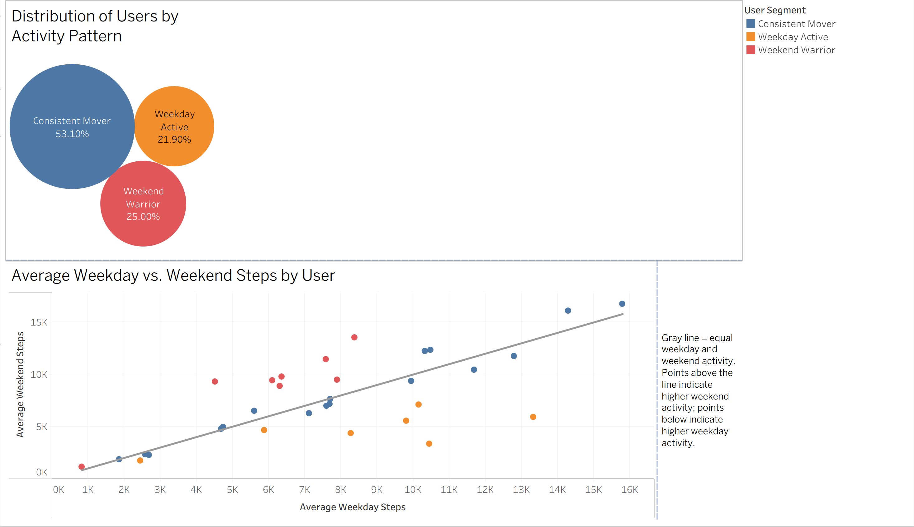
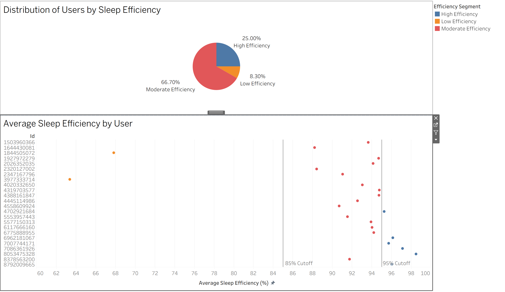
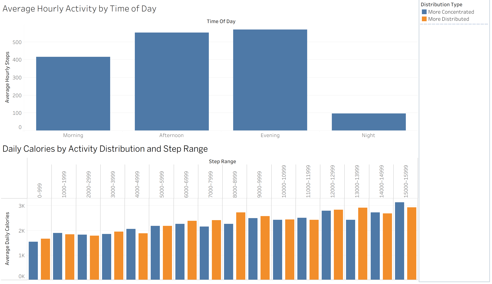

# Fitbit User Behavior & Product Insights

## Project Overview
Fitness tracking platforms generate large amounts of behavioral data related to physical activity, sleep, and movement throughout the day. However, users do not necessarily engage in the same way. Understanding these behavioral differences can help product teams identify opportunities to support healthier habits and improve user engagement.

This product analytics case study analyzes Fitbit user data to identify activity patterns, evaluate sleep efficiency, and explore how the timing and distribution of physical activity differ across users.

Using SQL for data preparation, validation, segmentation, and analysis, and Tableau for data visualization, the project translates behavioral findings into data-driven product recommendations.

## Business Problem

The Product Team wants to better understand behavioral differences among Fitbit users and identify opportunities to encourage healthier and more consistent engagement.

This analysis examines users' activity consistency, sleep efficiency, and daily activity patterns to uncover behaviors that could inform product decisions and support habit formation.

## Project Goal

Analyze Fitbit user data to identify meaningful behavioral patterns, understand differences in activity and sleep behavior, and translate the findings into actionable product recommendations that could improve user engagement and encourage healthier habits.

## Research Questions

### Main Question

**What behavioral patterns can be identified among Fitbit users, and how can these insights inform opportunities to improve user engagement and habit formation?**

### Supporting Questions

1. **Weekday vs. Weekend Activity:** Are users consistent in their activity habits, or do some primarily concentrate their activity on weekends ("Weekend Warriors")?

2. **Sleep Efficiency:** How efficiently do users sleep relative to the time they spend in bed, and what differences exist across sleep-efficiency levels?

3. **Activity Timing & Distribution:** How do the timing and distribution of activity throughout the day relate to user outcomes?
## Dataset

This project uses the **FitBit Fitness Tracker Data** dataset, which contains personal fitness tracker data from Fitbit users. The data includes daily activity, hourly activity, sleep, steps, calories, and intensity measurements.

**Data Source:** [FitBit Fitness Tracker Data – Kaggle](https://www.kaggle.com/code/nadaemad2002/fitbit-fitness-tracker-data/input?select=Fitabase+Data+4.12.16-5.12.16)

The analysis primarily uses:

- **Daily Activity Data** : daily steps, calories, distance, and activity levels
- **Hourly Steps Data** : step counts recorded throughout the day
- **Hourly Calories Data** : calories recorded throughout the day
- **Hourly Intensity Data** : activity intensity recorded throughout the day
- **Sleep Data** : total minutes asleep and total time in bed

Because the dataset represents a relatively small sample of Fitbit users and a limited observation period, the findings should be interpreted as exploratory behavioral insights rather than conclusions about the entire Fitbit user population.

## Tools & Technologies

- **PostgreSQL** : data cleaning, transformation, validation, segmentation, and analysis
- **Tableau Public** : interactive visualizations, dashboards, and final data story
- **GitHub** : project documentation and code repository
## Repository Structure

```text
fitbit-user-behavior-analysis/
├── images/
│   ├── q1_weekday_weekend_activity.png
│   ├── q2_sleep_efficiency.png
│   └── q3_daily_activity_patterns.png
├── sql/
│   ├── 00_data_preparation.sql
│   ├── 01_q1_weekday_weekend_activity.sql
│   ├── 02_q2_sleep_efficiency.sql
│   ├── 03_q3_activity_timing_distribution.sql
│   └── 04_tableau_preparation.sql
└── README.md
```

- **`images/`** contains previews of the three Tableau dashboards.
- **`sql/`** contains the PostgreSQL data preparation, analysis, validation, and Tableau-ready dataset creation.
- **`README.md`** documents the business problem, methodology, findings, product recommendations, and interactive Tableau story.
## Data Preparation & Methodology

Before answering the research questions, the datasets were reviewed and prepared in PostgreSQL to ensure the analysis was based on consistent and reliable records.

Key preparation steps included:

- Audited each dataset for record counts, user coverage, date ranges, missing values, and duplicates.
- Removed confirmed duplicate sleep records before calculating sleep metrics.
- Converted and standardized date and time fields to support daily and hourly analysis.
- Created derived features such as weekday/weekend classification, time-of-day periods, sleep efficiency, and activity distribution measures.
- Aggregated behavioral metrics at the appropriate user, daily, and hourly levels for each research question.
- Segmented users into behavioral groups based on defined analytical thresholds.
- Performed validation checks throughout the analysis to confirm user counts, ranges, and final outputs before visualization.
- Created analysis-ready tables in PostgreSQL for use in Tableau.

### Analytical Approach

The analysis was structured around three behavioral dimensions:

1. **Activity Consistency** : compared average weekday and weekend step counts at the user level to identify different activity patterns.
2. **Sleep Efficiency** : calculated the percentage of time in bed that users spent asleep and compared efficiency patterns across users.
3. **Activity Timing & Distribution** : examined activity across different periods of the day and compared concentrated versus distributed activity patterns while accounting for daily step volume.
## Analysis & Key Findings

### Q1: Weekday vs. Weekend Activity Patterns

To understand whether users maintain consistent activity throughout the week, average weekday and weekend step counts were calculated for each user. A weekend-to-weekday activity ratio was then used to classify users into three behavioral segments.

**Results:**

- **Consistent Movers:** 17 users (53.1%) maintained relatively similar weekday and weekend activity levels.
- **Weekend Warriors:** 8 users (25.0%) showed substantially higher activity on weekends.
- **Weekday Active:** 7 users (21.9%) showed higher activity during weekdays.
- 32 of the 33 users were included in this comparison. One user was excluded because no weekend activity records were available.

**Key Finding:**  
Most users maintained relatively consistent activity throughout the week, but 46.9% showed a stronger tendency toward either weekday or weekend activity.


### Q2: Sleep Efficiency Patterns

Sleep efficiency was calculated as the percentage of time in bed that a user actually spent asleep:

**Sleep Efficiency = Total Minutes Asleep ÷ Total Time in Bed × 100**

Average sleep efficiency was calculated for each of the 24 users with available sleep data and grouped into analytical efficiency segments.

For this case study, users were segmented as Low (<85%), Moderate (85%–<95%), and High (≥95%) sleep efficiency. These thresholds are analytical categories used for this project rather than clinical classifications.

**Results:**

- **Moderate Efficiency:** 16 users (66.7%)
- **High Efficiency:** 6 users (25.0%)
- **Low Efficiency:** 2 users (8.3%)
- Average user-level sleep efficiency ranged from **63.37% to 98.49%**.

**Key Finding:**  
Most users fell within the analysis-defined moderate sleep-efficiency segment, while only a small portion of users showed low average sleep efficiency.


### Q3: Activity Timing & Distribution Patterns

Activity was analyzed across four periods of the day to understand when users were most active.

**Average hourly steps and intensity by time period:**

| Time Period | Avg. Hourly Steps | Avg. Intensity |
|-------------|------------------:|---------------:|
| Morning | 415.3 | 15.10 |
| Afternoon | 552.4 | 19.82 |
| Evening | 569.0 | 21.64 |
| Night | 97.0 | 4.41 |

Evening showed the highest average hourly steps and intensity, closely followed by afternoon, while nighttime activity was substantially lower.

To examine activity distribution separately from overall activity volume, days with similar total step counts were compared across concentrated and distributed activity patterns.

Across **16 comparable step ranges**:

- Distributed activity showed higher average calories in **9 ranges**.
- Concentrated activity showed higher average calories in **7 ranges**.

**Key Finding:**   
Activity was highest during the afternoon and evening. When comparing days with similar total step counts, distributed activity showed higher average calorie expenditure in 9 of 16 comparable step ranges, while concentrated activity was higher in 7.

Because the difference was relatively small, neither activity pattern consistently showed higher calorie expenditure. This suggests that overall activity volume may be more important than how activity is distributed throughout the day, although further analysis would be needed to confirm this relationship.
## Product Recommendations

Based on the behavioral patterns identified in the analysis, the following product opportunities could help Fitbit provide more personalized support and encourage consistent user engagement.

### Q1: Support More Consistent Weekly Activity

**Personalized Weekly Activity Summary**
- Provide users with a weekly summary showing how their activity is distributed between weekdays and weekends.
- Highlight whether their activity pattern is relatively consistent, weekday-focused, or weekend-focused so users can better understand their habits.

**Targeted Activity Challenges**
- Offer personalized challenges during users' typically less-active parts of the week.
- For example, Weekend Warriors could receive weekday movement challenges, while Weekday Active users could receive weekend challenges.
- Use badges, streaks, or other in-app rewards to encourage participation and reinforce more consistent activity.

**Positive Reinforcement**
- Provide encouraging messages after users complete activity goals or meaningful exercise sessions to reinforce continued engagement.

---

### Q2: Personalize Support Based on Sleep Efficiency

**Moderate Sleep Efficiency**
- Provide personalized bedtime and wake-time reminders designed to encourage a more consistent sleep schedule.
- Surface evening wind-down reminders and relaxation activities that may help users establish a consistent nighttime routine.

**High Sleep Efficiency**
- Recognize consistent sleep performance through badges, streaks, or positive feedback.
- Encourage users to maintain the sleep routines associated with their stronger sleep-efficiency patterns.

**Low Sleep Efficiency**
- Provide additional sleep-routine support, such as bedtime reminders, screen-time wind-down prompts, and relaxation or breathing exercises.
- Allow users to set consistent sleep and wake-time goals and track their progress over time.

These recommendations should function as behavioral support rather than medical guidance.

---

### Q3: Adapt Engagement to Users' Daily Activity Patterns

**Time-Aware Activity Reminders**
- Personalize activity reminders based on each user's typical daily activity pattern rather than sending the same reminders at the same times to every user.
- Offer activity prompts during periods when an individual user is typically less active.

**Test Personalized Activity Distribution**

- Distributed activity showed higher average calorie expenditure in 9 of 16 comparable step ranges (56.3%), while concentrated activity was higher in 7 ranges.
- Since the difference was relatively small, there is not enough evidence to conclude that distributed activity is consistently associated with higher calorie expenditure.
- Fitbit could test personalized prompts that encourage users to spread movement throughout the day while continuing to prioritize overall daily activity goals.
- The results could help determine whether these prompts improve user engagement before implementing them more broadly.

**Personalized Daily Activity Insights**
- Show users when they are typically most and least active and provide personalized suggestions based on their individual routines.
## Interactive Tableau Dashboard

The final analysis is presented through an interactive Tableau Story containing three dashboards:

- **Weekday vs. Weekend Activity Patterns** : explores user activity segments and compares average weekday and weekend steps.
- **Sleep Efficiency Patterns** : shows the distribution of sleep-efficiency segments and differences in average sleep efficiency across users.
- **Activity Timing & Distribution Patterns** : examines activity throughout the day and compares calorie expenditure across activity-distribution patterns.

**[View the Interactive Tableau Story](https://public.tableau.com/app/profile/fatima.zahra.hamdoune/viz/FitbitUserBehaviorProductInsights/Story1?publish=yes)**
### Dashboard Preview

#### Q1: Weekday vs. Weekend Activity



**How to read it:** Each point represents a Fitbit user. The diagonal reference line represents equal weekday and weekend activity. Points above the line indicate higher weekend activity, while points below the line indicate higher weekday activity.

#### Q2: Sleep Efficiency Patterns



**How to read it:** Sleep efficiency represents the percentage of time in bed actually spent asleep. The 85% and 95% reference lines show the thresholds used to classify users into Low, Moderate, and High Efficiency segments.

#### Q3: Activity Timing & Distribution Patterns



**How to read it:** The first visualization compares average activity across different times of day. The second compares average daily calories for more concentrated versus more distributed activity within similar step ranges.
